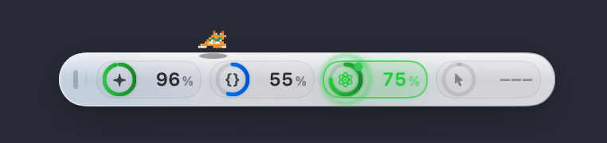

<h1 align="center">Glancie</h1>

<p align="center">
  How much you have left in Claude Code, Codex, Antigravity and friends —<br>
  in one capsule bar floating on your macOS desktop.
</p>

<p align="center">
  <a href="README.md">한국어</a> · <b>English</b>
</p>

<p align="center">
  
  
  <a href="LICENSE"></a>
  
</p>

<p align="center">
  <a href="#install">Install</a> ·
  <a href="#supported-providers">Providers</a> ·
  <a href="#privacy">Privacy</a> ·
  <a href="CONTRIBUTING.md">Contributing</a> ·
  <a href="SECURITY.md">Security</a> ·
  <a href="wiki/INDEX.md">Design notes</a>
</p>

```text
 ╭──────────────────────────────────────────────────────────────────────────╮
 │ ⠿ │ ✦ Claude 82% ▰▰▰▰▰▱ │ ◈ Codex 45% ▰▰▰▱▱▱ │ ◆ AGY 98% ▰▰▰▰▰▰ │ ⏱ 2h 18m │
 ╰──────────────────────────────────────────────────────────────────────────╯
```

<p align="center">
  
</p>

---

## Who this is for

- You hit a limit in Claude Code, switch to Codex, then to Antigravity.
- You open a terminal and type `/usage` just to find out which one still has room.
- You have hesitated to start something big because you did not know when the limit resets.

Glancie removes that check. The **remaining usage and time until reset** for every provider you enable sits on a thin bar that is always on screen.

Three promises:

- **There is no server.** Usage is read only from files the tools already left on your Mac and from each provider's official API. Nothing is sent anywhere.
- **No invented numbers.** A value that cannot be read is shown as "No data", never guessed. This is the project's first rule.
- **It stays out of the way.** An `LSUIElement` app, so no Dock icon, and it does not spawn CLIs freely or burn CPU and battery.

### What it does not do

Expectations first:

- **It does not save usage for you.** It shows; it never intercepts or blocks requests.
- **It does not track cost.** This is about remaining quota, not your bill.
- **macOS only.** It is built on AppKit `NSPanel`; there is no plan to port it.
- **It cannot show what a provider does not publish.** With no documented way to read a quota, that provider stays "No data".

---

## Install

**Requirements** — macOS 14.0 (Sonoma) or later, and a Swift 5.9+ toolchain (Xcode 15+, or a toolchain from [swift.org](https://www.swift.org/download/)).

There is no published release yet, so build from source:

```bash
git clone https://github.com/ktkfree/glancie.git
cd glancie

# 1) Just try it
swift run Glancie

# 2) Build a .app if you like it
./scripts/build_manual.sh
```

`build_manual.sh` does a release build, assembles the `.app`, zips it, and **asks before installing into `/Applications`.** Skip the prompt with `GLANCIE_INSTALL=1` (install) or `GLANCIE_SKIP_INSTALL=1` (don't). For a DMG, use `./scripts/build-dmg.sh`.

### ⚠️ If the app will not open (Gatekeeper)

Glancie is **not signed or notarized** yet. A `.app` you did not build yourself will be blocked the first time. Either **right-click → Open** once in Finder, or run:

```bash
xattr -dr com.apple.quarantine /Applications/Glancie.app
```

This does not apply to binaries you built with `swift run` or `swift build`.

---

## First launch

Nothing to configure. Glancie **finds the tools installed and signed in on this Mac** and enables only those.

1. A `✨` icon appears in the menu bar.
2. The capsule bar appears, and each detected provider slides in as a segment.
3. Drag it where you want it; it comes back there next launch.

The language follows macOS: Korean if your system is Korean, English otherwise.

To pick providers yourself: menu bar `✨` → **Settings → Providers on the bar**.

---

## Using it

| To do this | Do that |
| :--- | :--- |
| **Move the bar** | Drag the grip (`⠿`) on the left, or any empty space. It will not leave the visible screen |
| **See details** | Click a provider segment — session / weekly / per-model quota with reset countdowns. Clicking another segment swaps the contents instead of closing the card |
| **Refresh now** | Menu bar `✨` → **Refresh All** |
| **Open settings** | Menu bar `✨` → **Settings…** |
| **About the app** | Menu bar `✨` → **About Glancie** — version, source link, the maker |
| **Quit** | Menu bar `✨` → **Quit Glancie**, or `pkill -f Glancie` |

### What you can change in Settings

- **Language** — `Follow System` · `한국어` · `English`. Applies immediately
- **Providers on the bar** — which ones to show (at least one)
- **Account detection / Mask email** — see [Privacy](#privacy)
- **Haptics & sound**, **Eye tracking** — interaction feedback
- **Pixel cat** — an optional companion that walks the bar, reacts to clicks and drags, and comes in several coats

### Reading the bar

- **The gauge and %** — what is **left**, not what is used
- **⏱ countdown** — time until the next reset
- **A pulse** — that provider is working right now. When the turn ends, its quota is re-read immediately
- **"No data"** — nothing readable. It does not mean 0%

---

## Supported providers

### Providers whose usage is actually shown

| Provider | What you see | To connect it |
| :--- | :--- | :--- |
| **Claude Code** | Session (5h), weekly, per-model remaining | `claude` CLI installed + signed in |
| **OpenAI Codex** | Session and weekly rate-limit remaining | `codex` CLI installed + signed in |
| **Antigravity (AGY)** | Gemini 5h/weekly, plus Claude and GPT per model | `agy` CLI installed + signed in |
| **GitHub Copilot** | Premium Interactions, Chat Requests (monthly) | Copilot signed in (`~/.config/github-copilot`) |
| **DeepSeek** | Remaining balance | `DEEPSEEK_API_KEY` |
| **OpenRouter** | Remaining credits and key budget | `OPENROUTER_API_KEY` |
| **Groq** | TPM / RPM remaining | `GROQ_API_KEY` |
| **Moonshot Kimi** | Remaining balance | `MOONSHOT_API_KEY` or `KIMI_API_KEY` |
| **ElevenLabs** | Tier and characters left | `ELEVENLABS_API_KEY` or `XI_API_KEY` |
| **Ollama** | Installed models and what is loaded | `ollama serve` running (`localhost:11434`) |

### Detected, but not measured

**Cursor · Windsurf · Zed AI · Mistral AI** — their installs and logins are detected, but there is no documented way to read a quota, so they show **"No data"**. No plausible-looking estimate is filled in.

Missing your tool? Open a [provider request](https://github.com/ktkfree/glancie/issues/new). Telling us where the usage can be read (an API, a file, a CLI command) is the fastest path.

### Multiple accounts

If you split profiles with `CLAUDE_CONFIG_DIR` or `CODEX_HOME`, each is read as **its own account** and quota is attributed to it. Switching accounts never hands the old account's numbers to the new one.

---

## Troubleshooting

<details>
<summary><b>A provider with an API key only fails inside the <code>.app</code></b></summary>

An app launched from Finder or Launchpad does not inherit your shell environment, so `export DEEPSEEK_API_KEY=...` in your terminal is invisible to it.

**The simplest fix is to keep the key in a file.** Every environment-variable provider also reads these paths:

```bash
mkdir -p ~/.config/deepseek && echo "sk-..." > ~/.config/deepseek/api_key
chmod 600 ~/.config/deepseek/api_key
```

| Provider | File |
| :--- | :--- |
| DeepSeek | `~/.config/deepseek/api_key` |
| OpenRouter | `~/.config/openrouter/api_key` |
| Groq | `~/.config/groq/api_key` |
| Moonshot Kimi | `~/.config/moonshot/api_key` |
| ElevenLabs | `~/.config/elevenlabs/api_key` |
| Mistral AI | `~/.config/mistral/api_key` |

CLI-based providers (Claude, Codex, AGY), Copilot and Ollama are unaffected.
</details>

<details>
<summary><b>A provider says "Detected" but the number says "No data"</b></summary>

Those are two different claims. **Detected** means the CLI or app was found on this Mac; the usage is read separately.

- Cursor, Windsurf, Zed and Mistral have no verified path, so they are **always** "No data"
- For the others: the login expired, the API key is no longer valid, or there is no usage recorded yet
- A value that never succeeded once stays empty. It is not filled with 0%
</details>

<details>
<summary><b>The numbers look frozen</b></summary>

When a call fails, Glancie keeps **the last successful reading taken with the same credential, and its original measurement time**, and shows that the refresh failed. It will not re-stamp an old number with the current time.

To retry immediately: menu bar → **Refresh All**. Opening the detail card also triggers a read.
</details>

<details>
<summary><b>The bar disappeared / went off-screen</b></summary>

The bar is pulled back inside the visible screen area. If it is still missing — say, after unplugging an external display — reset the stored position:

```bash
pkill -f Glancie
defaults delete com.glancie.app
```
</details>

<details>
<summary><b>Does it eat CPU or battery? Will it get me rate-limited (429)?</b></summary>

Avoiding both is the centre of the design.

- **Cache first** — whatever the tool left on disk is read first; a process is spawned only when that value is older than 15 minutes
- **Every 45 seconds** — that is the background sweep
- **Process spawning is centrally gated** — per-key minimum intervals (`claude` 5 min, `agy` 3 min), one run per key, and **one concurrent probe globally**
- **An extra read only when a turn ends** — file watching picks out real token streaming, and three seconds after the last write the quota is re-read once

The background and the traps actually hit are in [`wiki/usage-fetch-strategy-and-triggers.md`](wiki/usage-fetch-strategy-and-triggers.md).
</details>

<details>
<summary><b>Uninstalling</b></summary>

```bash
# 1. Stop it
pkill -f Glancie

# 2. Remove the app
rm -rf /Applications/Glancie.app

# 3. Clear stored settings (position, sound, enabled providers, language)
defaults delete com.glancie.app 2>/dev/null || true
defaults delete Glancie 2>/dev/null || true
```

Glancie installs nothing outside `/Applications`. Those preferences are all that is left behind.
</details>

---

## Privacy

Glancie **sends your usage data nowhere.** There is no analytics, telemetry or crash-reporting endpoint. Every external address in the code is either a provider's official API or a console/status page opened in your browser when you click it.

**What it reads**

- CLI runs — `claude -p "/usage"` and `agy -p "/usage"`, executing only binaries found by absolute path, never through a shell
- Local files — `~/.claude.json`, `~/.claude/projects/`, `~/.codex/`, `~/.gemini/`, `~/.cursor/`, `~/.config/github-copilot/`, `~/.config/zed/settings.json`, `~/.config/{deepseek,openrouter,groq,moonshot,elevenlabs,mistral}/api_key`
- Environment variables — the keys in the [provider table](#supported-providers), plus `CLAUDE_CONFIG_DIR`, `CODEX_HOME`, `GITHUB_TOKEN`/`COPILOT_TOKEN`

**Do not take our word for it.** Every address in the code fits in one command:

```bash
grep -rhoE 'https?://[^"]+' Sources/ | sort -u
```

What comes back is provider APIs and links opened in a browser. The full scope is written out in [`SECURITY.md`](SECURITY.md).

**Safeguards**

- **Email masking is on by default** — accounts render as `i***@gmail.com`, because this bar floats over whatever you are screen-sharing
- **Account detection can be turned off** — with it off, no provider's account files are read at all and only the quota gauges work
- **Diagnostics go through `os.Logger`** with account details marked `privacy: .private`

---

## Development

```bash
swift build
swift test --parallel      # 249 tests
```

Integration tests that call a real signed-in CLI or API are skipped by default. Turn them on only where Claude and Antigravity are installed, authenticated and have usage data:

```bash
GLANCIE_RUN_LOCAL_INTEGRATION_TESTS=1 swift test --filter testRealLocalAdaptersFetching
```

Debug logs, in three categories — `provider` (adapters and probes), `watcher` (file watching, activity filtering) and `accounts` (discovery and attribution):

```bash
log stream --predicate 'subsystem == "com.glancie"' --level debug
```

### CI

[`.gitlab-ci.yml`](.gitlab-ci.yml) — runs the tests and packages the DMG on the maintainer's self-hosted GitLab.

There are no automated checks on PRs yet, so please run the two commands above yourself.

<details>
<summary><b>Project layout</b></summary>

```
Sources/Glancie/
├── App/              NSApplication entry point, menu bar status item
├── Panel/            NSPanel floating window, dragging, screen placement
├── Providers/
│   ├── Core/         AIProviderProtocol, ProviderManager, ProbeGate,
│   │                 FSEventsWatcher, activity filtering, zero-config scanner
│   ├── Adapters/     Per-provider usage collection (14)
│   └── Accounts/     Account discovery, identity, usage attribution
├── Views/            Main bar, menu screens, gauges, detail card, pixel cat
├── Localization/     Language resolution and the string catalogue (ko/en)
├── DesignSystem/     Materials, springs, colour theme, sound
├── Storage/          UserDefaults preferences
└── Support/          os.Logger, Locked<Value>
```
</details>

---

## Contributing

Issues and PRs are welcome, in English or Korean.

- **Report a bug, or request a provider** — [open an issue](https://github.com/ktkfree/glancie/issues/new). For a provider, say where its usage can be read (an API, a file, a CLI command)
- **Write code** — [`CONTRIBUTING.md`](CONTRIBUTING.md) covers the dev setup, commit style, and how to add a provider
- **Report a vulnerability** — privately, via [`SECURITY.md`](SECURITY.md), not a public issue

Before a PR, check that `swift build && swift test --parallel` passes and the release build has zero warnings.

One rule above the rest: **never invent a number.** If it cannot be read, it is "No data".

---

## Roadmap

- [ ] **Screenshots** — this README needs real ones
- [ ] **Published releases** — built `.app` bundles on GitHub Releases
- [ ] **Signing and notarization** — distributed binaries are unsigned, so Gatekeeper has to be worked around
- [ ] **Cursor · Windsurf · Zed · Mistral quota** — added if a verified path is found
- [ ] **More languages** — Korean and English today; a third is one more axis in [`L10n.swift`](Sources/Glancie/Localization/L10n.swift)

---

## Documentation

- [`CONTRIBUTING.md`](CONTRIBUTING.md) — dev setup, commit style, adding a provider
- [`SECURITY.md`](SECURITY.md) — what this app reads, runs and sends; how to report a vulnerability
- [`wiki/INDEX.md`](wiki/INDEX.md) — the design decision record. The **why** lives here

---

## License

[MIT](LICENSE) — built by [Kang Pro's Lab](https://www.storyqbe.com)

Glancie is not affiliated with or endorsed by Anthropic, OpenAI, Google, GitHub, Cursor, Codeium, Zed Industries, DeepSeek, Moonshot AI, Mistral AI, Groq, ElevenLabs or OpenRouter. Product names are trademarks of their respective owners and are used only to identify those tools.
